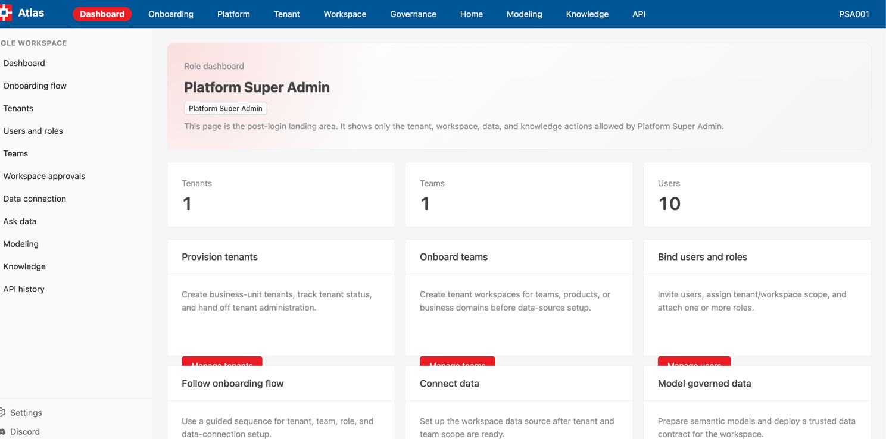
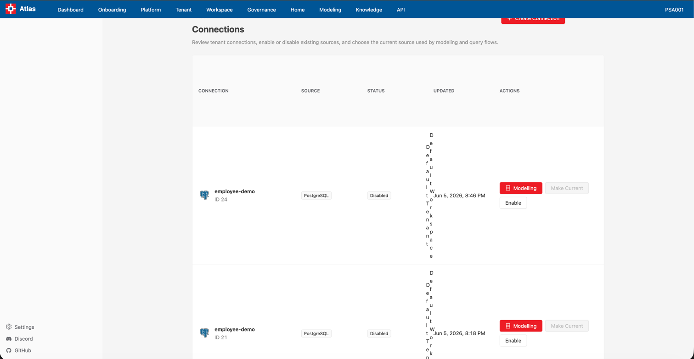

# GenBI Role Journeys

This document translates `TENANCY.md` into role-based journeys for the current GenBI UI. It combines:

* Role hierarchy and responsibilities from `TENANCY.md`
* RACI ownership from `TENANCY.md`
* Lifecycle and sequence-diagram order from `TENANCY.md`
* Implemented route access from `app/wren-ui/src/utils/rbac.ts`
* Implemented navigation surfaces from `app/wren-ui/src/utils/enum/path.ts`, `HeaderBar`, `Sidebar`, `Settings`, `Home`, `Knowledge`, and `APIManagement`

## 1. Role Hierarchy

| Level | Roles | Governance Intent |
| --- | --- | --- |
| Platform | Platform Super Admin, Platform Security Admin, Platform Operations Admin | Central control of tenant provisioning, global security, platform operations, AI infrastructure, audit, retention, and incidents. |
| Tenant | Tenant Admin, Tenant Data Steward, Tenant Developer | Business-unit control of users, roles, workspaces, data scope, semantic correctness, certified metrics, data connections, models, prompts, and tenant audit. |
| Workspace | Workspace Owner, Workspace Editor, Workspace Viewer | Team/use-case control of workspace standards, membership, asset approval, dashboard/report/prompt creation, and consumption. |
| Consumer | Business User | Governed consumption of dashboards, reports, and AI answers inside approved tenant/workspace/data scopes. |

## 2. Implemented Access Rules

The current UI maps pages to permissions as follows.

| Page or Surface | Route | Required Permission | Roles with Access |
| --- | --- | --- | --- |
| Login | `/login` | Public | All roles |
| Data source setup | `/setup/connection` | `MANAGE_DATA_SOURCE` | Platform Super Admin, Tenant Admin, Tenant Developer |
| Model selection setup | `/setup/models` | `MANAGE_DATA_SOURCE` | Platform Super Admin, Tenant Admin, Tenant Developer |
| Relationship setup | `/setup/relationships` | `MANAGE_DATA_SOURCE` | Platform Super Admin, Tenant Admin, Tenant Developer |
| Settings modal: Data source settings | Opened from sidebar, no route | `MANAGE_DATA_SOURCE` or `MANAGE_TENANT` | Platform Super Admin, Tenant Admin, Tenant Developer |
| Settings modal: Tenant settings | Opened from sidebar, no route | `MANAGE_DATA_SOURCE` or `MANAGE_TENANT` | Platform Super Admin, Tenant Admin, Tenant Developer |
| Modeling | `/modeling` | `MANAGE_MODELING` | Platform Super Admin, Tenant Data Steward, Tenant Developer |
| Knowledge: Question-SQL pairs | `/knowledge/question-sql-pairs` | `MANAGE_KNOWLEDGE` | Platform Super Admin, Tenant Data Steward, Tenant Developer, Workspace Owner, Workspace Editor |
| Knowledge: Instructions | `/knowledge/instructions` | `MANAGE_KNOWLEDGE` | Platform Super Admin, Tenant Data Steward, Tenant Developer, Workspace Owner, Workspace Editor |
| Home: Ask AI | `/home` | `RUN_AI_QUERY` | Platform Super Admin, Tenant Admin, Tenant Data Steward, Tenant Developer, Workspace Owner, Workspace Editor, Workspace Viewer, Business User |
| Home: Thread detail | `/home/[id]` | `RUN_AI_QUERY` | Platform Super Admin, Tenant Admin, Tenant Data Steward, Tenant Developer, Workspace Owner, Workspace Editor, Workspace Viewer, Business User |
| Home: Dashboard | `/home/dashboard` | `RUN_AI_QUERY` | Platform Super Admin, Tenant Admin, Tenant Data Steward, Tenant Developer, Workspace Owner, Workspace Editor, Workspace Viewer, Business User |
| API management: API history | `/api-management/history` | `VIEW_API_HISTORY` | Platform Super Admin, Platform Security Admin, Tenant Admin, Workspace Owner |

Implementation gap: `TENANCY.md` defines platform operations, security policy, tenant/workspace/user/role administration, workspace membership, asset approval, global AI policy, data retention, incident, and full audit experiences. The current app does not expose dedicated UI routes for all of those activities. Where a role is accountable in RACI but no page exists, the tables below mark the activity as a gap.

## 3. Lifecycle Page Order

This order follows the end-to-end lifecycle and sequence diagram in `TENANCY.md`.

| Order | Lifecycle Stage | Primary Roles from TENANCY.md | Implemented Pages or Surfaces |
| --- | --- | --- | --- |
| 1 | Authenticate | All roles | `/login` |
| 2 | Tenant provisioning | Platform Super Admin accountable, Platform Security Admin consulted, Platform Operations Admin responsible for IAM/SCIM support | Gap: no tenant creation, SSO, IAM, SCIM, or tenant suspension page |
| 3 | Platform setup | Platform Operations Admin accountable/responsible, Platform Security Admin responsible, Platform Super Admin accountable | Gap: no platform health, LLM provider, monitoring, security policy, MFA, retention, or global policy page |
| 4 | Tenant setup and data scope | Tenant Admin accountable, Tenant Developer responsible for connection details, Tenant Data Steward responsible for allowed data definitions | `/setup/connection`, Settings modal |
| 5 | Data model setup | Tenant Developer responsible, Tenant Data Steward accountable for semantic correctness, Tenant Admin consulted | `/setup/models`, `/setup/relationships`, `/modeling` |
| 6 | Knowledge and semantic governance | Tenant Data Steward accountable/responsible, Tenant Developer responsible, Workspace Owner consulted | `/knowledge/question-sql-pairs`, `/knowledge/instructions`, `/modeling` |
| 7 | Workspace setup | Tenant Admin accountable, Workspace Owner responsible | Gap: no workspace creation, membership, role mapping, or workspace standards page |
| 8 | Content creation | Workspace Editor responsible, Tenant Developer responsible for AI assets, Workspace Owner accountable for approval | `/home/dashboard`, `/knowledge/question-sql-pairs`, `/knowledge/instructions` |
| 9 | Consumption | Workspace Viewer and Business User responsible | `/home`, `/home/[id]`, `/home/dashboard` |
| 10 | Governance and audit | Workspace Owner for workspace audit, Tenant Admin for tenant audit, Platform Security Admin for security audit, Platform Super Admin for platform governance | `/api-management/history`; gaps for tenant/workspace/platform audit pages |
| 11 | Incident management | Platform Security Admin, Platform Operations Admin, Tenant Admin | Gap: no incident-management page |

## 4. Role Journey Tables

### 4.1 Platform Super Admin

| Order | Accessible Page or Surface | Route | Activity Scope on Page | TENANCY/RACI Basis |
| --- | --- | --- | --- | --- |
| 1 | Login | `/login` | Authenticate as platform-wide administrator. | Entry point for platform governance. |
| 2 | Tenant provisioning | Gap | Create tenant, suspend/delete tenant, assign initial Tenant Admin, configure global policies, configure SSO/IAM/SCIM, configure AI models/LLMs, define retention policies. | Accountable for tenant creation, tenant deletion, initial Tenant Admin assignment, SSO/IAM, SCIM, global policies, AI models, retention, and platform audit. |
| 3 | Data source setup | `/setup/connection` | Current app permits connection setup. In governance terms this should be exceptional platform oversight, not normal tenant execution. | Current RBAC grants `MANAGE_DATA_SOURCE`; RACI makes Tenant Admin accountable and Tenant Developer responsible. |
| 4 | Model selection setup | `/setup/models` | Current app permits selecting models during setup. Governance use is oversight or emergency bootstrap. | Current RBAC grants `MANAGE_DATA_SOURCE`; semantic ownership belongs to Tenant Data Steward and Tenant Developer. |
| 5 | Relationship setup | `/setup/relationships` | Current app permits relationship setup. Governance use is oversight or emergency bootstrap. | Current RBAC grants `MANAGE_DATA_SOURCE`; model creation is steward/developer owned in RACI. |
| 6 | Settings: Data source settings | Modal | View/update/reset data source configuration where exposed. | Current RBAC grants settings access; RACI treats data connection as tenant-owned. |
| 7 | Settings: Tenant settings | Modal | View tenant/project context. Full tenant lifecycle controls are not implemented here. | Platform Super Admin owns tenant lifecycle in TENANCY.md. |
| 8 | Modeling | `/modeling` | Inspect or modify semantic models, metadata, relationships, calculated fields, and deployment controls. | Current RBAC grants `MANAGE_MODELING`; RACI assigns semantic responsibility to Data Steward/Developer. |
| 9 | Knowledge: Question-SQL pairs | `/knowledge/question-sql-pairs` | Manage saved question-to-SQL examples used by AI. | Current RBAC grants `MANAGE_KNOWLEDGE`; RACI assigns prompt/template creation to Developer/Editor with Owner approval. |
| 10 | Knowledge: Instructions | `/knowledge/instructions` | Manage instructions that guide AI behavior. | Current RBAC grants `MANAGE_KNOWLEDGE`; global AI governance belongs to platform, tenant AI policy belongs to Tenant Admin/Data Steward. |
| 11 | Home: Ask AI | `/home` | Run governed AI queries within assigned scope. | Current RBAC grants `RUN_AI_QUERY`; TENANCY.md treats consumption as viewer/business-user activity. |
| 12 | Home: Thread detail | `/home/[id]` | Review query thread, SQL, chart, and answer output. | Platform governance/audit review may require insight review. |
| 13 | Home: Dashboard | `/home/dashboard` | View dashboards and dashboard results. | Current RBAC grants `RUN_AI_QUERY`; content ownership is workspace-level. |
| 14 | API history | `/api-management/history` | Review API usage history as part of platform-wide audit. | Accountable for platform audit review; current app exposes API history only. |
| 15 | Incident management | Gap | Investigate platform-wide incidents and review audit trails. | Accountable for incident investigation at platform level. |

### 4.2 Platform Security Admin

| Order | Accessible Page or Surface | Route | Activity Scope on Page | TENANCY/RACI Basis |
| --- | --- | --- | --- | --- |
| 1 | Login | `/login` | Authenticate as security administrator. | Entry point for security governance. |
| 2 | Security policy setup | Gap | Define security policies, access governance, data classification, MFA/session policy, sensitive-data policy review, and compliance controls. | Responsible for global security policies, access governance, classification, security audit, and security incident investigation. |
| 3 | API history | `/api-management/history` | Review API calls and usage history. Current app does not expose full security audit logs or access violations. | Responsible for security audit logs and platform audit review; consulted on tenant/data-scope/security activities. |
| 4 | Incident management | Gap | Investigate security incidents, access violations, and generate security audit trail. | Responsible for security incidents in sequence diagram and RACI. |

### 4.3 Platform Operations Admin

| Order | Accessible Page or Surface | Route | Activity Scope on Page | TENANCY/RACI Basis |
| --- | --- | --- | --- | --- |
| 1 | Login | `/login` | Authenticate as operations administrator. | Entry point for platform operations. |
| 2 | Platform operations | Gap | Platform upgrades, monitoring, observability, capacity planning, incident response, Trino/Iceberg/integration management, AI infrastructure setup. | Accountable/responsible for upgrades and monitoring; responsible for IAM/SCIM operational support, LLM infrastructure, operational incident response. |
| 3 | Platform health and performance | Gap | Review platform health, operational logs, capacity, performance metrics, and integration status. | Explicit in sequence diagram: review platform health and performance metrics. |

Implementation note: current RBAC defines `MANAGE_OPERATIONS`, but no route uses it. This role currently has no concrete post-login landing page in the implemented UI.

### 4.4 Tenant Admin

| Order | Accessible Page or Surface | Route | Activity Scope on Page | TENANCY/RACI Basis |
| --- | --- | --- | --- | --- |
| 1 | Login | `/login` | Authenticate within assigned tenant scope. | Tenant setup begins when Tenant Admin logs in. |
| 2 | Tenant user and role management | Gap | Onboard users, assign tenant roles, map AD/SCIM groups, assign Workspace Owner/Editor/Viewer. | Accountable/responsible for onboarding tenant users and assigning tenant roles. |
| 3 | Workspace setup | Gap | Create workspace, archive/delete workspace, assign owner, add members, define workspace membership. | Accountable for workspace creation/deletion; consulted on workspace membership. |
| 4 | Data source setup | `/setup/connection` | Register data source and approve tenant-level connection setup. | Accountable for creating/configuring data connection; Developer is responsible for details. |
| 5 | Model selection setup | `/setup/models` | Select allowed source objects during onboarding. | Accountable for allowed catalog/schema/table scope; Data Steward responsible for definitions. |
| 6 | Relationship setup | `/setup/relationships` | Complete setup flow and tenant bootstrap where needed. | Tenant Admin is consulted for semantic model creation and metadata maintenance. |
| 7 | Settings: Data source settings | Modal | Update/reset tenant data source configuration. | Accountable for data connection and tenant data scope. |
| 8 | Settings: Tenant settings | Modal | View tenant, workspace, and project context. Full tenant administration is not implemented. | Tenant Admin owns tenant metadata, workspace configuration, and tenant audit. |
| 9 | Home: Ask AI | `/home` | Run AI queries within tenant/workspace/data scope. | Current RBAC grants `RUN_AI_QUERY`; TENANCY.md says Tenant Admin cannot bypass source-level security. |
| 10 | Home: Thread detail | `/home/[id]` | Review generated SQL, answers, charts, and query flow for tenant troubleshooting. | Tenant Admin can investigate tenant-level issues and allowed datasets. |
| 11 | Home: Dashboard | `/home/dashboard` | View dashboards and tenant-visible published content. | Current RBAC grants consumption access; dashboard creation is Editor/Developer with Owner approval. |
| 12 | API history | `/api-management/history` | Review tenant/API activity exposed by current app. | Accountable/responsible for tenant audit logs; current page is API history only. |
| 13 | Tenant incident management | Gap | Investigate tenant incidents using tenant activity logs. | Tenant Admin investigates tenant-level incidents in sequence diagram. |

### 4.5 Tenant Data Steward

| Order | Accessible Page or Surface | Route | Activity Scope on Page | TENANCY/RACI Basis |
| --- | --- | --- | --- | --- |
| 1 | Login | `/login` | Authenticate within assigned tenant scope. | Entry point for semantic governance. |
| 2 | Business glossary | Gap | Define business glossary and standardized terms. | Accountable/responsible for glossary. |
| 3 | KPI and metric governance | `/modeling` | Govern model metadata, metric semantics, definitions, relationships, and dataset readiness. | Accountable/responsible for KPIs, metrics, dataset certification, metadata maintenance; Developer is responsible for implementation. |
| 4 | Model review and deployment | `/modeling` | Review semantic model quality and deploy/certify where current controls permit. | Sequence diagram: Data Steward reviews semantic model and certifies datasets. |
| 5 | Knowledge: Question-SQL pairs | `/knowledge/question-sql-pairs` | Curate governed examples that improve AI query correctness. | Consulted on prompts and AI assets; accountable for semantic correctness. |
| 6 | Knowledge: Instructions | `/knowledge/instructions` | Maintain business instructions and data-use guidance for AI. | Responsible for tenant AI policy inputs and semantic constraints. |
| 7 | Home: Ask AI | `/home` | Validate AI behavior from a steward perspective. | AI correctness depends on semantic layer and role-based filtering. |
| 8 | Home: Thread detail | `/home/[id]` | Inspect answers, SQL, and charts for semantic accuracy. | Steward owns correctness of definitions and certified metrics. |
| 9 | Home: Dashboard | `/home/dashboard` | Review dashboards for metric correctness and certified dataset usage. | Consulted on dashboard/report creation. |

### 4.6 Tenant Developer

| Order | Accessible Page or Surface | Route | Activity Scope on Page | TENANCY/RACI Basis |
| --- | --- | --- | --- | --- |
| 1 | Login | `/login` | Authenticate within assigned tenant scope. | Entry point for tenant implementation work. |
| 2 | Data source setup | `/setup/connection` | Configure connection details and validate connectivity to Trino/Databricks/BQ/SQL/etc. | Responsible for data connection setup/configuration; Tenant Admin accountable. |
| 3 | Model selection setup | `/setup/models` | Select source models/tables for semantic onboarding. | Responsible for semantic model implementation. |
| 4 | Relationship setup | `/setup/relationships` | Create source/model relationships used by semantic layer and AI. | Responsible for relationships and metric definitions. |
| 5 | Settings: Data source settings | Modal | Update/reset connection settings when implementation changes are needed. | Responsible for connection details and integrations. |
| 6 | Settings: Tenant settings | Modal | View tenant/workspace/project context for implementation alignment. | Developer is consulted on tenant AI/data scope decisions. |
| 7 | Modeling | `/modeling` | Create and maintain semantic models, metadata, relationships, calculated fields, views, and deploy model changes. | Responsible for semantic models, metadata maintenance, AI agents, prompts, dashboards/reports technical build. |
| 8 | Knowledge: Question-SQL pairs | `/knowledge/question-sql-pairs` | Create and maintain validated SQL examples, saved query patterns, and AI grounding examples. | Accountable/responsible for AI agents; responsible for prompts/templates with steward/owner consultation. |
| 9 | Knowledge: Instructions | `/knowledge/instructions` | Create prompt instructions and AI behavior guidance. | Responsible for AI agents and prompt templates. |
| 10 | Home: Ask AI | `/home` | Test AI query behavior after model and prompt changes. | AI access is controlled by tenant/workspace/data scope and semantic layer. |
| 11 | Home: Thread detail | `/home/[id]` | Debug generated SQL, adjust SQL/reasoning where available, verify answer quality. | Developer is responsible for query optimization and AI asset implementation. |
| 12 | Home: Dashboard | `/home/dashboard` | Build, validate, or troubleshoot dashboards and reports. | RACI lists Developer as responsible for dashboards/reports, with Workspace Owner accountable and Editor responsible. |

### 4.7 Workspace Owner

| Order | Accessible Page or Surface | Route | Activity Scope on Page | TENANCY/RACI Basis |
| --- | --- | --- | --- | --- |
| 1 | Login | `/login` | Authenticate within assigned workspace scope. | Entry point for workspace governance. |
| 2 | Workspace configuration | Gap | Configure workspace, standards, membership, usage monitoring, archive/delete requests, and role mapping. | Accountable/responsible for workspace governance and membership; responsible for workspace creation/deletion with Tenant Admin accountable. |
| 3 | Knowledge: Question-SQL pairs | `/knowledge/question-sql-pairs` | Review and manage workspace-shared question-SQL assets. | Consulted on KPIs and AI assets; accountable for publishing/approving workspace assets. |
| 4 | Knowledge: Instructions | `/knowledge/instructions` | Review and manage workspace AI instructions before production use. | Workspace Owner approves production asset usage. |
| 5 | Home: Ask AI | `/home` | Run AI queries to validate published workspace assets. | Current RBAC grants consumption and dashboard/knowledge management. |
| 6 | Home: Thread detail | `/home/[id]` | Review thread outputs for workspace usage, quality, and asset fitness. | Workspace Owner reviews workspace activity and approves assets. |
| 7 | Home: Dashboard | `/home/dashboard` | Review dashboards, published reports, and workspace results. | Accountable for dashboard/report creation and approval. |
| 8 | API history | `/api-management/history` | Review workspace/API usage history exposed by current app. | RACI: accountable/responsible for workspace audit logs; current app exposes API history only. |
| 9 | Asset approval workflow | Gap | Approve/reject assets submitted by Workspace Editor or Tenant Developer. | Accountable/responsible for approving workspace assets. |

### 4.8 Workspace Editor

| Order | Accessible Page or Surface | Route | Activity Scope on Page | TENANCY/RACI Basis |
| --- | --- | --- | --- | --- |
| 1 | Login | `/login` | Authenticate within assigned workspace scope. | Entry point for content creation. |
| 2 | Knowledge: Question-SQL pairs | `/knowledge/question-sql-pairs` | Create, update, and maintain saved question-SQL pairs for workspace reuse. | Responsible for prompt/templates and shared assets; can create prompts and AI assets. |
| 3 | Knowledge: Instructions | `/knowledge/instructions` | Create and update instructions for workspace AI behavior. | Responsible for prompt templates with Developer accountable and Owner approval. |
| 4 | Home: Ask AI | `/home` | Create prompts, test AI answers, and generate analysis for workspace users. | Responsible for creating prompts and running AI within workspace scope. |
| 5 | Home: Thread detail | `/home/[id]` | Refine answers, inspect SQL, adjust outputs where available, and prepare assets for sharing. | Content creation and saved query/report workflow. |
| 6 | Home: Dashboard | `/home/dashboard` | Create or update dashboard content where available and submit assets for publication. | Responsible for creating dashboards/reports; Workspace Owner accountable for approval. |
| 7 | Asset submission workflow | Gap | Submit dashboards, reports, saved queries, and AI assets for publication approval. | Sequence diagram includes "Submit Assets for Publication"; current app has no dedicated approval route. |

### 4.9 Workspace Viewer

| Order | Accessible Page or Surface | Route | Activity Scope on Page | TENANCY/RACI Basis |
| --- | --- | --- | --- | --- |
| 1 | Login | `/login` | Authenticate within assigned workspace scope. | Entry point for governed consumption. |
| 2 | Home: Ask AI | `/home` | Ask business questions and run AI queries against authorized workspace datasets. | Responsible for running AI queries. |
| 3 | Home: Thread detail | `/home/[id]` | View answers, SQL/chart output where exposed, and continue existing conversations. | Consumption of reports and AI results. |
| 4 | Home: Dashboard | `/home/dashboard` | Consume published dashboards and report results. | Responsible for consuming reports/dashboards. |

### 4.10 Business User

| Order | Accessible Page or Surface | Route | Activity Scope on Page | TENANCY/RACI Basis |
| --- | --- | --- | --- | --- |
| 1 | Login | `/login` | Authenticate as a governed consumer. | Entry point for business consumption. |
| 2 | Home: Ask AI | `/home` | Ask business questions within assigned tenant/workspace/data scope. | Responsible for running AI queries and decision-making. |
| 3 | Home: Thread detail | `/home/[id]` | Review AI insight, generated answer, chart, and supporting results. | Consumer of AI insights and reports. |
| 4 | Home: Dashboard | `/home/dashboard` | View dashboards and reports for decision-making. | Responsible for consuming reports. |

## 5. RACI-Derived Activity Scope by Page

| Implemented Page or Gap | Accountable Roles | Responsible Roles | Consulted Roles | Informed Roles | Notes |
| --- | --- | --- | --- | --- | --- |
| Tenant provisioning gap | Platform Super Admin | Platform Super Admin | Platform Security Admin | All tenant/workspace/user roles | Required by lifecycle but not implemented as a page. |
| SSO/IAM/SCIM gap | Platform Super Admin | Platform Operations Admin | Platform Security Admin | Tenant roles | Required by sequence diagram but not implemented as a page. |
| Platform security policy gap | Platform Super Admin | Platform Security Admin | Platform Operations Admin | Tenant/workspace roles | No current page for MFA/session/security policy or data classification. |
| Platform operations gap | Platform Operations Admin | Platform Operations Admin | Platform Super Admin, Platform Security Admin | Tenant/workspace roles | No current page for monitoring, observability, upgrades, capacity, or integrations. |
| Data source setup | Tenant Admin | Tenant Developer | Platform Operations Admin | Other roles | Implemented as `/setup/connection`; Platform Super Admin can access by current RBAC but is not the normal RACI owner. |
| Data scope definition gap/settings | Tenant Admin | Tenant Data Steward | Platform Security Admin, Tenant Developer | Workspace/consumer roles | Current app exposes setup/settings, but no complete catalog/schema/table/view policy UI. |
| Semantic modeling | Tenant Data Steward | Tenant Developer | Tenant Admin | Workspace/consumer roles | Implemented as `/modeling`; includes models, metadata, relationships, views, deploy controls. |
| Knowledge management | Tenant Developer or Tenant Data Steward depending asset | Tenant Developer, Workspace Editor | Tenant Admin, Tenant Data Steward, Workspace Owner | Viewer/Business User | Implemented as question-SQL pairs and instructions. |
| Workspace setup gap | Tenant Admin | Workspace Owner | Tenant Admin | Workspace members | No current page for workspace creation, member management, role mapping, or standards. |
| Dashboard/report creation | Workspace Owner | Workspace Editor, Tenant Developer | Tenant Data Steward | Viewer/Business User | Dashboard surface exists, but approval/publication workflow is not a dedicated page. |
| Asset approval gap | Workspace Owner | Workspace Owner | Tenant Developer, Tenant Data Steward | Workspace Editor, Viewer/Business User | Sequence diagram includes review/approval; no dedicated page. |
| AI query consumption | Workspace Viewer, Business User | Workspace Viewer, Business User | Tenant Data Steward/Developer for quality issues | Workspace Owner/Tenant Admin as needed | Implemented as `/home` and `/home/[id]`. |
| API/audit history | Platform Super Admin, Tenant Admin, Workspace Owner depending scope | Platform Security Admin for security audit; Workspace Owner for workspace audit; Tenant Admin for tenant audit | Platform Operations Admin | Other roles as needed | Current page is `/api-management/history`; tenant/workspace/platform audit separation is not fully implemented. |
| Incident management gap | Platform Super Admin, Platform Security Admin, Platform Operations Admin, Tenant Admin by incident type | Platform Security Admin, Platform Operations Admin, Tenant Admin | Tenant Data Steward, Tenant Developer | Workspace/consumer roles as needed | No current incident page. |

## 6. Sequence-Diagram Walkthrough

| Sequence Block | Expected Flow from TENANCY.md | Current UI Coverage | Required Role Journey Impact |
| --- | --- | --- | --- |
| Tenant Provisioning | Tenant Admin requests onboarding; Platform Super Admin requests Security review; Platform Security Admin approves; Platform Super Admin creates tenant and initial Tenant Admin; IAM mapping is created. | Not covered by current UI pages. | Platform Super Admin, Security Admin, and Operations Admin need future platform admin pages. |
| Platform Setup | Platform Operations Admin configures services, monitoring, observability, and AI infrastructure; Platform Security Admin configures policies, MFA/session, and audit requirements. | Not covered by current UI pages. | Platform Operations Admin currently has no implemented journey beyond login. |
| Tenant Setup | Tenant Admin registers data source; Tenant Developer configures details; GenBI validates connection; Tenant Admin defines allowed catalogs/schemas/tables; Security Admin reviews sensitive data policies. | Partly covered by `/setup/connection`, settings, and setup flow. | Tenant Admin and Tenant Developer have setup access; Security review and fine-grained data-scope UI are gaps. |
| Semantic Layer Creation | Data Steward creates glossary/KPIs/certified metrics; Developer builds semantic models, relationships, metric definitions; Steward reviews and certifies. | Partly covered by `/modeling` and `/knowledge/*`. | Tenant Data Steward and Tenant Developer have modeling/knowledge access; glossary/certification-specific pages are gaps. |
| Workspace Creation | Tenant Admin creates workspace; Workspace Owner configures standards; Tenant Admin adds members and assigns owner/editor/viewer. | Not covered by current UI pages. | Tenant Admin and Workspace Owner need workspace administration pages. |
| Content Creation | Workspace Editor creates reports, dashboards, saved queries; Tenant Developer creates AI agents and prompt templates; Editor submits assets; Owner reviews and approves; GenBI publishes. | Partly covered by dashboard and knowledge pages. | Workspace Editor and Tenant Developer can create assets; Owner can manage/review assets, but approval workflow is missing. |
| Business Consumption | Workspace Viewer opens dashboard and runs AI query; Business User asks question; GenBI executes authorized query and returns result. | Covered by `/home`, `/home/[id]`, `/home/dashboard`. | Viewer and Business User have the cleanest implemented journey. |
| Governance and Audit | Workspace Owner reviews workspace activity; Tenant Admin reviews tenant audit; Security Admin reviews security logs/access violations; Operations Admin reviews platform health/performance; Super Admin reviews platform governance. | Partly covered by `/api-management/history`. | API history exists, but scoped workspace/tenant/platform/security/ops audit pages are gaps. |
| Incident Management | Security Admin investigates security incidents; Operations Admin investigates platform incidents; Tenant Admin investigates tenant incidents; GenBI returns relevant trails/logs. | Not covered by current UI pages. | Incident-specific journeys are governance requirements but not implemented. |

## 7. Key Conclusions

| Area | Conclusion |
| --- | --- |
| Best implemented journeys | Tenant Developer, Tenant Data Steward, Workspace Editor, Workspace Viewer, and Business User have usable page flows aligned to setup/modeling/knowledge/consumption. |
| Largest implementation gaps | Platform Operations Admin, Platform Security Admin, Platform Super Admin, Tenant Admin, and Workspace Owner need dedicated administration pages for the responsibilities described in `TENANCY.md`. |
| RBAC mismatch | `MANAGE_PLATFORM`, `MANAGE_SECURITY`, `MANAGE_OPERATIONS`, and `MANAGE_WORKSPACE` exist as permissions but are not tied to dedicated UI routes. |
| Governance mismatch | RACI defines tenant/workspace/user/role management, policy management, audit, incident, and approval workflows, but current UI mostly covers BI setup, modeling, knowledge, dashboards, AI queries, and API history. |
| Correct journey order | The correct enterprise lifecycle is: authenticate -> tenant/platform setup -> tenant data setup -> semantic setup -> workspace setup -> content creation -> consumption -> audit/governance -> incident management. |

## 8. Implemented UI Integration Update

The following role-journey gaps are now implemented in the Wren UI.

| Journey Gap | Implemented Page | Route | Backing API | Roles Integrated |
| --- | --- | --- | --- | --- |
| Tenant provisioning | Tenant provisioning | `/platform/tenants` | `/api/admin/tenants`, `/api/admin/tenants/[id]` | Platform Super Admin |
| Tenant user and role management | Tenant users and roles | `/tenant/users` | `/api/admin/users`, `/api/admin/users/[id]` | Platform Super Admin, Tenant Admin |
| Workspace setup | Tenant workspaces | `/tenant/workspaces` | `/api/admin/workspaces`, `/api/admin/workspaces/[id]` | Platform Super Admin, Tenant Admin |
| Business glossary | Business glossary | `/governance/glossary` | `/api/admin/governance-assets?type=GLOSSARY` | Platform Super Admin, Tenant Data Steward, Tenant Developer |
| Asset submission and approval | Workspace asset approvals | `/workspace/approvals` | `/api/admin/governance-assets?type=APPROVAL`, `/api/admin/governance-assets/[id]` | Platform Super Admin, Tenant Admin, Tenant Developer, Workspace Owner, Workspace Editor |
| Consumption journeys | Existing Home, Thread, Dashboard pages | `/home`, `/home/[id]`, `/home/dashboard` | Existing query/dashboard APIs | Workspace Viewer, Business User, and higher roles with `RUN_AI_QUERY` |

Updated access behavior:

| Route Group | Permission Gate |
| --- | --- |
| `/platform/*` | `MANAGE_PLATFORM` |
| `/tenant/*` | `MANAGE_TENANT` |
| `/workspace/*` | `MANAGE_WORKSPACE` or `MANAGE_DASHBOARD` |
| `/governance/*` | `MANAGE_KNOWLEDGE` or `MANAGE_MODELING` |

Remaining gaps after this implementation:

| Gap | Reason |
| --- | --- |
| Platform Security Admin policy pages | Security policy, MFA/session policy, data classification, and access violation review still need dedicated product surfaces. |
| Platform Operations Admin pages | Monitoring, observability, platform health, upgrades, capacity, and integration management still need dedicated product surfaces. |
| Full audit and incident workbench | API history exists, but scoped tenant/workspace/platform audit and incident-management workflows remain separate future work. |

 After successful login why the workflow route to http://localhost:3000/setup/connection page. After login, the app must redirect a page that show a dashboard which represent role specific informations. Before
  setting up connection the app must allow onboard Tenant, Teams, bind roles etc. as per the scope of the role of logged in user.
 Create a dedicated UI flow to onboard tenants and other entities.
Settings modal: Tenant settings	Opened from sidebar, no route	MANAGE_DATA_SOURCE or MANAGE_TENANT	Platform Super Admin, Tenant Admin, Tenant Developer

http://localhost:3000/modeling?connectionId=29 must list all the tables and http://localhost:3000/modeling?connectionId=30 must list only 4 tables. But actually after creating
  http://localhost:3000/modeling?connectionId=30 model, http://localhost:3000/modeling?connectionId=29 is also showing 4 tables only. Please fix this issue.

