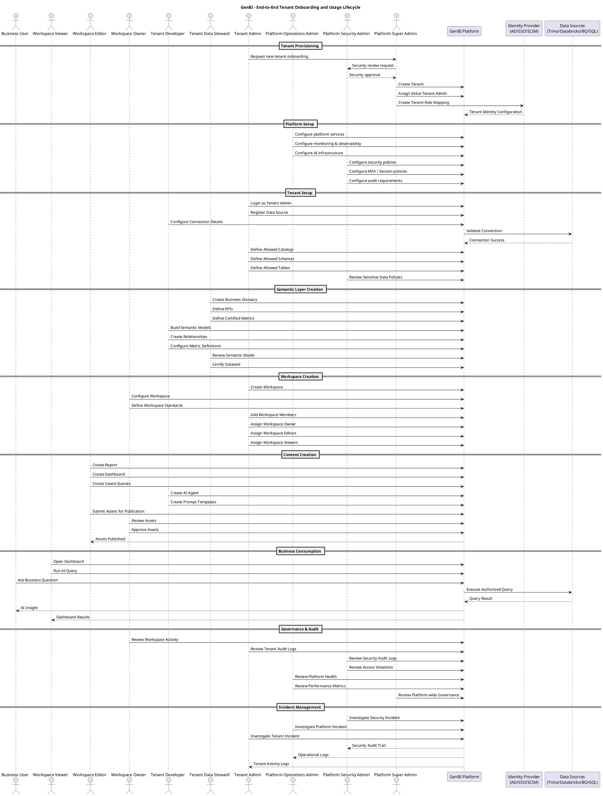

# GenBI Multi-Tenancy and Governance Architecture (HDFC)

## 1. Overview

GenBI is a centralized AI-driven BI platform deployed across HDFC Bank with a single deployment model. It enables multiple business units to operate as logical tenants while sharing a governed Lakehouse (Iceberg via Trino).

Each tenant manages its own:

* Data sources
* Semantic layer
* Workspaces
* Users and roles
* AI assets

---

# 2. Multi-Tenancy Model

## 2.1 Architecture

```text
GenBI Platform
│
├── Tenant (Business Unit)
│     ├── Data Connections
│     ├── Semantic Layer
│     ├── Users & Roles
│     └── Workspaces
│
└── Workspace (Team / Use Case)
      ├── Dashboards
      ├── Reports
      ├── AI Agents
      └── Saved Queries
```

---

## 2.2 Principles

* Single platform deployment
* Business Unit = Tenant
* Workspace = team/use-case collaboration unit
* Strict tenant isolation (metadata + RBAC)
* Lakehouse as governed shared data layer
* Source-level enforcement (Trino/Iceberg)

---

# 3. Role Hierarchy

## Platform Level

* Platform Super Admin
* Platform Security Admin
* Platform Operations Admin

## Tenant Level

* Tenant Admin
* Tenant Data Steward
* Tenant Developer

## Workspace Level

* Workspace Owner
* Workspace Editor
* Workspace Viewer

## Consumer Level

* Business User

---

# 4. Responsibilities (UNCHANGED STRUCTURE)

## 4.1 Platform Super Admin

* Create tenant
* Suspend/delete tenant
* Assign initial tenant admin
* Configure SSO / IAM / SCIM
* Define global policies
* Configure AI models / LLM providers
* Platform audit review
* Data retention policies
* Incident investigation (platform level)

---

## 4.2 Platform Security Admin

* Security policies
* Access governance
* Data classification
* Compliance oversight
* Security audit logs
* Incident investigation (security)

---

## 4.3 Platform Operations Admin

* Platform upgrades
* Monitoring and observability
* Capacity planning
* Incident response (platform)
* Integration management (Trino, Iceberg, etc.)

---

## 4.4 Tenant Admin

* Tenant user management
* Role assignment
* Workspace creation
* Data source registration
* Define data access scope (catalog/schema/table/view)
* Tenant-level AI policy configuration
* Tenant audit logs

---

## 4.5 Tenant Data Steward

* Business glossary
* KPI definitions
* Metrics governance
* Dataset certification
* Metadata management

---

## 4.6 Tenant Developer

* Data connections setup
* Semantic model creation
* AI agents and prompts
* Dashboards and reports development
* Query optimization

---

## 4.7 Workspace Owner

* Workspace governance
* Member management
* Asset approval
* Workspace standards
* Usage monitoring

---

## 4.8 Workspace Editor

* Create dashboards
* Create reports
* Create prompts
* Build AI assets
* Share within workspace

---

## 4.9 Workspace Viewer / Business User

* Consume dashboards
* Run AI queries
* View reports
* Decision-making

---

# 5. RACI Matrix (UNCHANGED)

| Activity                               | Platform Super Admin | Platform Security Admin | Platform Operations Admin | Tenant Admin | Tenant Data Steward | Tenant Developer | Workspace Owner | Workspace Editor | Workspace Viewer | Business User |
| -------------------------------------- | -------------------- | ----------------------- | ------------------------- | ------------ | ------------------- | ---------------- | --------------- | ---------------- | ---------------- | ------------- |
| Create Tenant                          | A                    | C                       | I                         | I            | I                   | I                | I               | I                | I                | I             |
| Suspend/Delete Tenant                  | A                    | C                       | I                         | I            | I                   | I                | I               | I                | I                | I             |
| Assign Initial Tenant Admin            | A                    | C                       | I                         | I            | I                   | I                | I               | I                | I                | I             |
| Configure SSO / IAM                    | A                    | C                       | R                         | I            | I                   | I                | I               | I                | I                | I             |
| Configure SCIM / AD Sync               | A                    | C                       | R                         | I            | I                   | I                | I               | I                | I                | I             |
| Platform Upgrade                       | I                    | I                       | A/R                       | I            | I                   | I                | I               | I                | I                | I             |
| Platform Monitoring                    | I                    | I                       | A/R                       | I            | I                   | I                | I               | I                | I                | I             |
| Platform Audit Review                  | A                    | R                       | C                         | I            | I                   | I                | I               | I                | I                | I             |
| Define Global Security Policies        | A                    | R                       | C                         | I            | I                   | I                | I               | I                | I                | I             |
| Configure AI Models / LLMs             | A                    | C                       | R                         | I            | I                   | I                | I               | I                | I                | I             |
| Create Data Connection                 | I                    | I                       | C                         | A            | I                   | R                | I               | I                | I                | I             |
| Configure Data Connection              | I                    | I                       | C                         | A            | I                   | R                | I               | I                | I                | I             |
| Define Allowed Catalogs/Schemas/Tables | I                    | C                       | I                         | A            | R                   | C                | I               | I                | I                | I             |
| Define Row/Column Security Rules       | I                    | A                       | I                         | R            | C                   | C                | I               | I                | I                | I             |
| Onboard Tenant Users                   | I                    | I                       | I                         | A/R          | I                   | I                | I               | I                | I                | I             |
| Assign Tenant Roles                    | I                    | C                       | I                         | A/R          | I                   | I                | I               | I                | I                | I             |
| Create Workspace                       | I                    | I                       | I                         | A            | I                   | I                | R               | I                | I                | I             |
| Archive/Delete Workspace               | I                    | I                       | I                         | A            | I                   | I                | R               | I                | I                | I             |
| Manage Workspace Membership            | I                    | I                       | I                         | C            | I                   | I                | A/R             | I                | I                | I             |
| Create Semantic Models                 | I                    | I                       | I                         | C            | A                   | R                | I               | I                | I                | I             |
| Define Business Glossary               | I                    | I                       | I                         | C            | A/R                 | C                | I               | I                | I                | I             |
| Define KPIs and Metrics                | I                    | I                       | I                         | C            | A/R                 | R                | C               | I                | I                | I             |
| Certify Datasets                       | I                    | I                       | I                         | C            | A/R                 | C                | I               | I                | I                | I             |
| Maintain Metadata                      | I                    | I                       | I                         | C            | A                   | R                | I               | I                | I                | I             |
| Create Dashboards                      | I                    | I                       | I                         | I            | C                   | R                | A               | R                | I                | I             |
| Create Reports                         | I                    | I                       | I                         | I            | C                   | R                | A               | R                | I                | I             |
| Create AI Agents                       | I                    | I                       | I                         | C            | C                   | A/R              | C               | R                | I                | I             |
| Create Prompt Templates                | I                    | I                       | I                         | C            | C                   | A                | C               | R                | I                | I             |
| Publish Shared Assets                  | I                    | I                       | I                         | I            | C                   | R                | A               | R                | I                | I             |
| Approve Workspace Assets               | I                    | I                       | I                         | I            | C                   | C                | A/R             | I                | I                | I             |
| Run AI Queries                         | I                    | I                       | I                         | I            | I                   | I                | I               | I                | R                | R             |
| Consume Reports                        | I                    | I                       | I                         | I            | I                   | I                | I               | I                | R                | R             |
| View Workspace Audit Logs              | I                    | I                       | I                         | C            | I                   | I                | A/R             | I                | I                | I             |
| View Tenant Audit Logs                 | I                    | C                       | I                         | A/R          | I                   | I                | I               | I                | I                | I             |
| View Platform Audit Logs               | A                    | R                       | C                         | I            | I                   | I                | I               | I                | I                | I             |
| Manage Tenant AI Policies              | I                    | C                       | I                         | A            | R                   | C                | I               | I                | I                | I             |
| Manage Data Retention Policies         | A                    | R                       | C                         | C            | I                   | I                | I               | I                | I                | I             |
| Incident Investigation                 | A                    | R                       | R                         | C            | C                   | C                | I               | I                | I                | I             |

---

# 6. End-to-End Lifecycle

## 6.1 Tenant Onboarding

* Business unit request
* Platform Super Admin creates tenant
* Security approval
* Tenant admin assignment

---

## 6.2 Data & Semantic Setup

* Data source registration (Tenant Admin + Developer)
* Data scope definition
* KPI and glossary creation (Data Steward)
* Semantic model creation (Developer)
* Dataset certification (Data Steward)

---

## 6.3 Workspace Setup

* Workspace creation (Tenant Admin)
* Workspace ownership assignment
* Role mapping (Owner / Editor / Viewer)

---

## 6.4 Content Creation

* Dashboards and reports (Editors)
* AI agents (Developers)
* Approval (Workspace Owner)
* Publishing

---

## 6.5 Consumption

* Business users query AI
* Dashboards rendered
* Trino executes authorized queries

---

# 7. SEQUENCE DIAGRAM (UNCHANGED)



---

# 8. FAQ (UNCHANGED CONTENT SET KEPT)

### Q: What is a tenant?

A business unit representation in GenBI.

### Q: Is workspace personal?

No, it is team-based.

### Q: Who controls data access?

Tenant Admin + Security Admin + Lakehouse enforcement.

### Q: Can tenants share data directly?

No, only via Lakehouse curated datasets.

---

## 9. Summary

GenBI implements a strict hierarchical governance model:

* Platform controls infrastructure and security
* Tenants control business usage
* Data Stewards control semantics
* Developers implement models
* Workspaces enable collaboration
* Business users consume insights

This ensures scalable, secure, and AI-governed analytics across HDFC Bank.

---

# 13. Frequently Asked Questions (FAQs)

## 13.1 Multi-Tenancy and Structure

### Q1. What is a tenant in GenBI?

A tenant represents a **Business Unit (BU)** in HDFC, such as Credit Card, Loans, Wealth, or Risk. Each tenant has isolated:

* Users
* Workspaces
* Semantic models
* Data access policies
* AI configurations

---

### Q2. Is GenBI physically multi-tenant or logically multi-tenant?

GenBI is a **logically multi-tenant system** deployed as a single platform. Isolation is enforced through:

* RBAC (Role-Based Access Control)
* Metadata separation
* Workspace scoping
* Data access policies (Trino/Lakehouse)
* AI context restrictions

---

### Q3. Can one tenant access another tenant’s data?

No direct access is allowed.

Cross-tenant data sharing happens only via:

* Curated Lakehouse datasets
* Reporting or shared governance layer
* Explicit approvals by Data Owners and Security Admins

---

### Q4. Who owns the tenant?

Each tenant is owned by a **Tenant Admin**, but:

* Platform Super Admin owns tenant creation
* Business Unit leadership governs data usage decisions
* Tenant Data Steward governs semantic correctness

---

## 13.2 Workspaces

### Q5. What is a workspace in GenBI?

A workspace is a **collaborative environment within a tenant** where teams:

* Build dashboards
* Create reports
* Define AI agents
* Share insights

It is not a personal space; it is a **team-level construct**.

---

### Q6. Does every user have their own workspace?

No.

Workspaces are **shared across users in a business function or team**.

However, an optional “Personal Sandbox Workspace” can be provided for experimentation.

---

### Q7. Can a user belong to multiple workspaces?

Yes.

Example:

* Fraud Workspace → Editor
* Executive Workspace → Viewer
* Marketing Workspace → Viewer

Access depends on role assignments.

---

### Q8. Who creates workspaces?

Workspaces are created by:

* Tenant Admin (primary responsibility)
* Workspace Owner (operational configuration)

---

## 13.3 Roles and Responsibilities

### Q9. Who is responsible for data definitions and KPIs?

The **Tenant Data Steward** is responsible for:

* Business glossary
* KPI definitions
* Metric standardization
* Dataset certification

---

### Q10. Who builds dashboards and reports?

Primarily:

* Workspace Editors (create)
* Workspace Owners (approve)

Tenant Developers may also contribute technical components.

---

### Q11. Who manages AI prompts and agents?

* Tenant Developers create AI agents and prompt templates
* Workspace Editors may use them
* Workspace Owners approve production usage

---

### Q12. Who controls data access?

Data access is controlled in layers:

* Platform Security Admin → Global policies
* Tenant Admin → Tenant-level access scope
* Trino/Lakehouse → Enforces physical access

---

### Q13. Can Tenant Admin access all data?

No.

Tenant Admin can only access:

* Metadata
* Allowed datasets
* Workspace configurations
* Audit logs

They cannot bypass source-level security.

---

## 13.4 Data and Lakehouse

### Q14. What is the role of the Lakehouse in GenBI?

The Lakehouse (Iceberg via Trino) is the:

* Central governed data layer
* Cross-team data sharing mechanism
* Primary analytics source for GenBI

GenBI does not bypass Lakehouse governance.

---

### Q15. Can GenBI directly query source systems?

Yes, but only if:

* The source is registered
* Access is approved
* It is allowed by Tenant Admin scope
* Security policies permit it

However, best practice is to use the Lakehouse.

---

## 13.5 Security and Governance

### Q16. How is security enforced in GenBI?

Security is enforced at four layers:

1. Platform level (global policies)
2. Tenant level (data scope restrictions)
3. Workspace level (RBAC)
4. Data source level (Trino/Iceberg permissions)

---

### Q17. Who handles security incidents?

* Platform Security Admin → Security incidents
* Platform Operations Admin → System incidents
* Tenant Admin → Tenant-level issues
* Workspace Owner → Workspace-related issues

---

### Q18. Is AI access controlled?

Yes. AI access is restricted by:

* Tenant scope
* Workspace scope
* Role-based permissions
* Allowed datasets only
* Semantic layer constraints

The LLM never sees unrestricted enterprise data.

---

## 13.6 Lifecycle and Ownership

### Q19. Who creates a tenant?

Only the **Platform Super Admin** can create tenants after approval.

---

### Q20. Who assigns the first Tenant Admin?

The **Platform Super Admin** assigns the initial Tenant Admin during tenant creation.

---

### Q21. Can Tenant Admin create other Tenant Admins?

Yes.

After bootstrap, Tenant Admin can:

* Add/remove Tenant Admins
* Manage tenant-level roles via AD/SCIM groups

---

### Q22. Who owns GenBI platform?

The **Central GenBI Platform Team**, represented by Platform Super Admin, Platform Security Admin, and Platform Operations Admin roles.

---

## 13.7 AI and Analytics

### Q23. How does GenBI ensure correct AI answers?

GenBI ensures correctness using:

* Semantic layer (business definitions)
* Allowed dataset scoping
* Workspace context injection
* Query validation through Trino/Lakehouse
* Role-based filtering

---

### Q24. Can users create their own AI agents?

Yes, but:

* Creation is done by Tenant Developers / Workspace Editors
* Usage is governed by Workspace Owners
* Sensitive deployments require Tenant Admin approval

---

### Q25. Is AI training done on enterprise data?

No.

GenBI uses enterprise data only for **query-time reasoning**, not model training, unless explicitly approved under separate governance policies.

---

## 13.8 Scalability and Operating Model

### Q26. How does GenBI scale across multiple business units?

Through:

* Logical tenant isolation
* Workspace-based collaboration
* Shared Lakehouse layer
* Centralized platform governance

---

### Q27. Why not give each user a personal workspace?

Because it leads to:

* Duplication of logic
* Inconsistent metrics
* Governance breakdown
* Poor reusability

Instead, GenBI uses **team-based workspaces**.

---

### Q28. What is the key design principle of GenBI?

> “Centralized governance with decentralized execution”

* Platform team governs infrastructure and security
* Business units own data usage
* Teams own analytics and AI consumption

---

